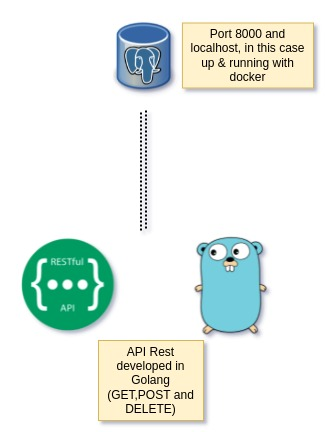

# Test an api REST in Golang

## Architecture diagram


## Requirements

* Install golang, in my case i do in ubuntu. Check official installation instructions [golang](https://go.dev/doc/install)

* Install or point to posgres/mysql database, in this case i will use posgresql. For example in docker, user and database name are posgres

```bash
docker run --name postgres-test -p 5432:5432 -e POSTGRES_PASSWORD=mysecretpassword -d postgres
```

* Create a sample table for our application, for example
```bash
docker exec -it postgres-test psql postgres postgres
```
```postgresql
CREATE TABLE clothes (
    id SERIAL,
    clothesID varchar(30) NOT NULL,
    clothesName varchar(30) NOT NULL,
    PRIMARY KEY (id)
);
```
```postgresql
          List of relations
 Schema |  Name   | Type  |  Owner   
--------+---------+-------+----------
 public | clothes | table | postgres
(1 row)
```

* Create some sample data
```postgresql
INSERT INTO clothes (
    clothesID,
    clothesName
)
VALUES
    ('1', 'trousers'),
    ('2 ', 'jeans'),
    ('3 ', 'socks'),
    ('4 ', 'trainers'),
    ('5', 'jacket');
```

* Check everything is ok with
```postgresql
select * from clothes;
```
```postgresql
 id | clothesid | clothesname 
----+-----------+-------------
  1 |         1 | trousers
  2 |         2 | jeans
  3 |         3 | socks
  4 |         4 | trainers
  5 |         5 | jacket
(5 rows)
```
--------

## Run 
Clone repository

```bash
git clone https://github.com/dcristobalh/api-rest-go.git
```
Enter the directory
```bash
cd api-rest-go
```
Run the program
```golang
go run .
```
## Test

Do it with curl or postman, for example

```bash
curl -X GET http://localhost:8000/clothes/
```